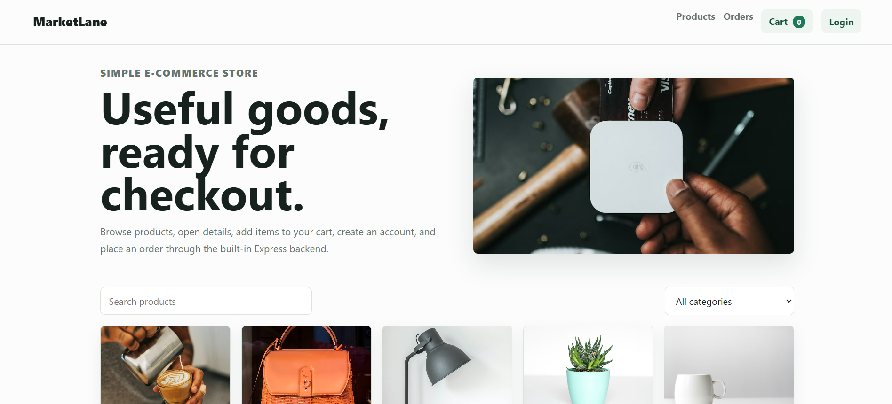
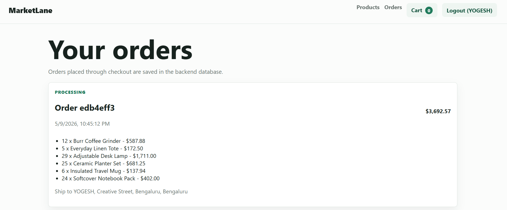

# MarketLane E-commerce Store

MarketLane is a simple e-commerce store built with HTML, CSS, JavaScript, and Express.js. It includes product listings, product details, a shopping cart, user registration/login, checkout, and order processing.

## Screenshots

### Home Page



### Orders Page



## Features

- Product listing grid with search and category filter
- Product details page
- Shopping cart with quantity controls
- User registration and login
- Checkout form
- Order processing and order history
- JSON database for products, users, sessions, and orders

## Tech Stack

- Frontend: HTML, CSS, JavaScript
- Backend: Node.js, Express.js
- Database: JSON file stored at `data/db.json`

## Project Structure

```text
.
├── assets/
│   ├── home-page.png
│   └── orders-page.png
├── data/
│   └── db.json
├── public/
│   ├── app.js
│   ├── index.html
│   └── styles.css
├── package.json
├── package-lock.json
├── README.md
└── server.js
```

## Run Locally

Install dependencies:

```powershell
npm.cmd install
```

Start the server:

```powershell
npm.cmd start
```

Open the app:

```text
http://127.0.0.1:3000
```

## API Routes

```text
GET    /api/products
GET    /api/products/:id
GET    /api/me
POST   /api/register
POST   /api/login
POST   /api/logout
GET    /api/orders
POST   /api/orders
```

## Website Usefulness

MarketLane is useful as a beginner-friendly full-stack e-commerce project. It shows how a store can display products, manage a shopping cart, register users, process checkout details, and save orders through a backend API.

The project can be used for learning how frontend pages communicate with an Express.js server. It includes common e-commerce flows such as browsing, filtering, viewing product details, logging in, checking out, and reviewing past orders.

It is also useful for college submissions, portfolio practice, and explaining the basic structure of an online shopping system. The JSON database keeps the setup simple, so the project can run locally without installing PostgreSQL, MongoDB, or any extra database software.

## Notes

This app uses `data/db.json` as a simple database, which is suitable for demos and learning projects. On hosted platforms, file changes may reset after redeploys or restarts.
